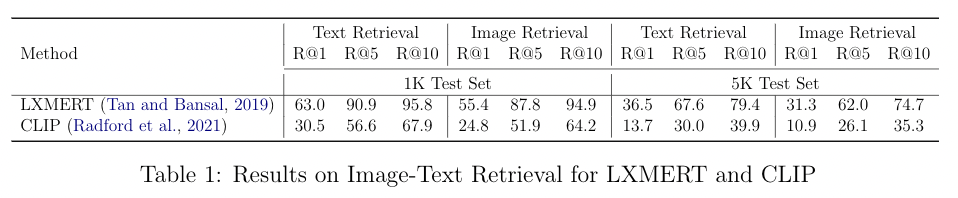

# lxmert_clip_tiir

Code repository for the Honors Thesis / COMPSCI 685 Final Project "Analyzing Low Recall Text-Image Retrieval with LXMERT and CLIP."

## Contents

- [Dataset](#dataset)
- [Installation and Setup](#installation-and-setup)
- Preprocessing
- Performance
- Running Experiments
- Error Analysis
- Citing

### Dataset

The data used for this research is obtained from Microsoft’s Common Objects 
in Context (MSCOCO) [(Lin et al., 2015)](https://arxiv.org/abs/1405.0312). MSCOCO is composed of 164,062
images with five textual captions for each image. These images are further divided into 82,783 training images, 40,504 validation images, and 40,775 test images. In image-text retrieval, the MSCOCO dataset is used for benchmarking performance ofthe models. However, since the captions for the test images are not publicly accessible, we use the [Karpathy and Fei-Fei (2015)](https://arxiv.org/abs/1412.2306) split, which take 5,000 images each for the validation and test splits from the original validation images and provides the remaining 30,504 images to the training split. So, there are 113,287 training images, and 5,000 images each for validation and testing.

All of the captions were obtained from [Li et al. (2020)](https://arxiv.org/abs/2004.06165), where they have the split captions in PyTorch files and every split necessary.

### Installation and Setup

First, clone the repository and optionally pull in the Faster R-CNN [(Ren et al., 2016)](https://arxiv.org/abs/1506.01497) submodule.

```shell
git clone https://github.com/gzhihongwei/lxmert_clip_tiir.git
git submodule update --init --recursive
```

Once that is done, run the below command to setup everything. Make sure that
[azcopy](https://docs.microsoft.com/en-us/azure/storage/common/storage-use-azcopy-v10#download-azcopy) is downloaded beforehand.

Then, run the setup script.

```shell
bash setup.sh
```

### Preprocessing

The preprocessing for LXMERT and CLIP is in [`preprocess/`](preprocess).
LXMERT needs Faster R-CNN features for each image, specifically normalized
bounding boxes and pooled image features. For CLIP, all of the images are 
dumped into an `.h5` file. 

### Performance




### Running Experiments

### Error Analysis

The error analysis code is ...

Error analysis code

### Citing

If you found this code useful, please cite using the following:

```bibtex
@misc{wei2021analyzing,
  author = {George Wei and Ina Fiterau and Mohit Iyyer},
  title = {Analyzing Low Recall Text-Image Retrieval with LXMERT and CLIP},
  year = {2021},
  publisher = {GitHub},
  journal = {GitHub repository},
  url = {https://github.com/gzhihongwei/lxmert_clip_tiir}
}
```
