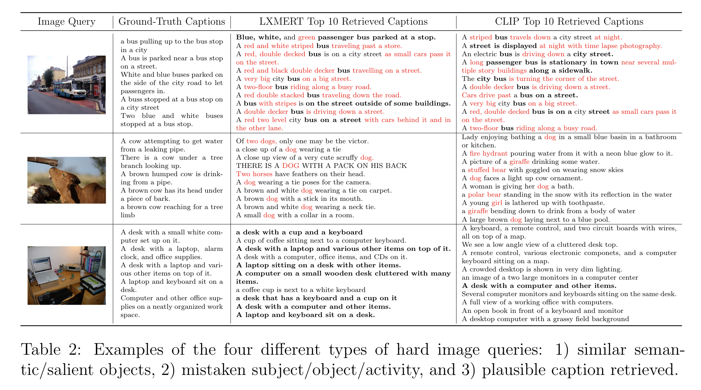
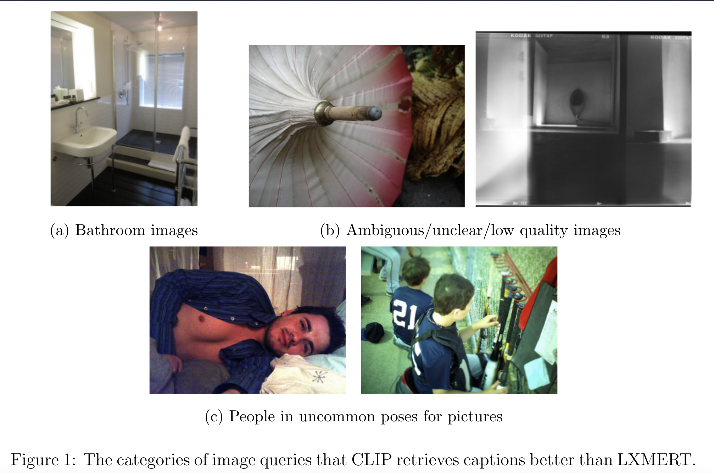

# lxmert_clip_tiir

Code repository for the Honors Thesis / COMPSCI 685 Final Project "Analyzing Low Recall Text-Image Retrieval with LXMERT and CLIP."

## Contents
---

- [Dataset](#dataset)
- [Installation and Setup](#installation-and-setup)
- [Preprocessing](#preprocessing)
- [Performance](#performance)
- [Running Experiments](#running-experiments)
- [Error Analysis](#error-analysis)
- [Citing](#citing)

## Dataset
---

The data used for this research is obtained from Microsoft’s Common Objects 
in Context (MSCOCO) [(Lin et al., 2015)](https://arxiv.org/abs/1405.0312). MSCOCO is composed of 164,062
images with five textual captions for each image. These images are further divided into 82,783 training images, 40,504 validation images, and 40,775 test images. In image-text retrieval, the MSCOCO dataset is used for benchmarking performance ofthe models. However, since the captions for the test images are not publicly accessible, we use the [Karpathy and Fei-Fei (2015)](https://arxiv.org/abs/1412.2306) split, which take 5,000 images each for the validation and test splits from the original validation images and provides the remaining 30,504 images to the training split. So, there are 113,287 training images, and 5,000 images each for validation and testing.

All of the captions were obtained from [Li et al. (2020)](https://arxiv.org/abs/2004.06165), where they have the split captions in PyTorch files and every split necessary.

## Installation and Setup
---

First, clone the repository and optionally pull in the Faster R-CNN [(Ren et al., 2016)](https://arxiv.org/abs/1506.01497) submodule.

```shell
git clone https://github.com/gzhihongwei/lxmert_clip_tiir.git
git submodule update --init --recursive
```

Once that is done, run the below command to setup everything. Make sure that
[azcopy](https://docs.microsoft.com/en-us/azure/storage/common/storage-use-azcopy-v10#download-azcopy) is downloaded beforehand.

Then, run the setup script.

```shell
bash setup.sh
```

## Preprocessing
---

The preprocessing for LXMERT and CLIP is in [`preprocess/`](preprocess).
LXMERT needs Faster R-CNN features for each image, specifically normalized
bounding boxes and pooled image features. For CLIP, all of the images are 
dumped into an `.h5` file. 

Both of these occur in a two step process. First, every image needs to be processed through Faster R-CNN for LXMERT or transfered to NumPy arrays for CLIP and ultimately dumped to an `.npz` file with the corresponding image id
assigned in MSCOCO as the file name. Second, all of the Faster features or numpified images need to be conglomerated into an `.h5` file for each split as specified in the Karpathy and Fei-Fei splits.

All of this preprocessing is handled in [`setup.sh`](setup.sh).

## Performance
---


Although obtaining high recall is not the goal of this project, table 1 shows the relative performance between the fine-tuned LXMERT [(Tan and Bansal, 2019)](https://arxiv.org/abs/1908.07490) and zero-shot transfer with CLIP [(Radford et. al, 2021)](https://arxiv.org/abs/2103.00020). These are in no way state of the art in text-image retrieval, but were very easily accessible since they are pretrained in the HuggingFace Transformers package [(Wolf et al., 2020)](https://aclanthology.org/2020.emnlp-demos.6/). Clearly LXMERT outperforms CLIP on paper, but in some cases doesn't retrieve any better than CLIP, which is impressive for just doing zero-shot transfer.

## Running Experiments

For LXMERT, [`lxmert_finetune.sh`](information_retrieval/lxmert_finetune.sh)
is a SLURM script that performs the fine-tuning of the pre-trained LXMERT
provided in HuggingFace Transformers. Additionally, [`lxmert_predict.sh`](information_retrieval/lxmert_predict.sh) is the prediction script for LXMERT and [`clip_zero_shot.sh`](information_retrieval/clip_zero_shot.sh) is that for CLIP. Look in [`utils.py`](information_retrieval/utils.py)
for the options for `ModelArguments` and `DataTrainingArguments`. Edit as needed.

## Error Analysis
---

The error analysis code is in [`error_analysis/`](error_analysis). It contains the saved ranking matrices from
`compute_metrics` (`.npz` files), the "hard"/"easy" retrievals for both models (`*_test.json`), and the retrievals for the example pictures (e.g. image retrieval that CLIP found to be difficult, so we also look at what LXMERT retrieved) which are in the form `*_retrievals_for_*.json`. To visualize all of these examples, look at [`error_exploration.ipynb`](error_analysis/error_exploration.ipynb). To generate more/less/all of the retrievals, edit [`error_analysis.py`](error_analysis/error_analysis.py). To get more comparisons between the models, take a look at [`comparison.py`](error_analysis/comparison.py).

Below are the related figures/tables in the papers.

### Text-based Image Retrieval


### Image-based Text Retrieval



### CLIP > LXMERT for Text-based Image Retrieval



### CLIP > LXMERT for Image-based Text Retrieval


## Citing

If you found this code useful, please cite using the following:

```bibtex
@misc{wei2021analyzing,
  author = {George Wei and Ina Fiterau and Mohit Iyyer},
  title = {Analyzing Low Recall Text-Image Retrieval with LXMERT and CLIP},
  year = {2021},
  publisher = {GitHub},
  journal = {GitHub repository},
  url = {https://github.com/gzhihongwei/lxmert_clip_tiir}
}
```
